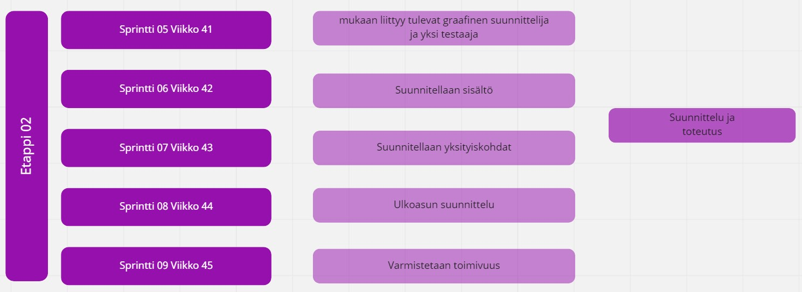
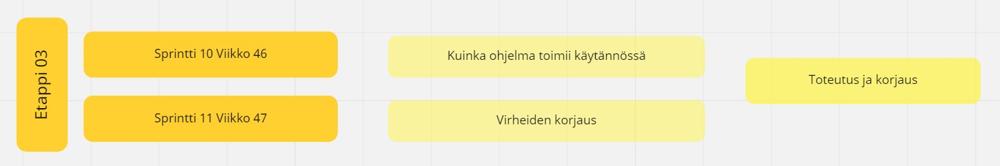
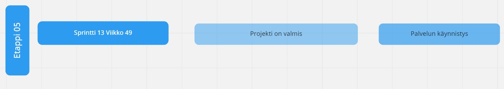

# Tiivistetty projektisuunnitelma

|  |  |
|:-:|:-:|
| Dokumentti | Tiivistetty projektisuunnitelma |
| Laatija: | Pirjo M |
| Versio: | 2.9 |
| Päivämäärä: |14.10.2022 |


## 1. Toimeksianto 
## 1.1 Tausta ja lähtökohdat

KCodeCerub Oy on saanut asiakkaakseen WIMMA Lab-koulutusympäristön, joka on nyt laajentamassa toimintaansa. WIMMA Labin toimintaa pyritään avaamaan eri sidosryhmille ja siihen tarvitaan uusia sähköisiä palveluja. Toimeksianto CodeCerub Oy:lle on kehittää WIMMA Labin käyttöön soveltuva Foorumi-palvelu, joka liitetään osaksi kotisivuja. Foorumin toteutuksen pohjana hyödynnetään (Open Source) avoimen lähdekoodin perustuvaa Conduit-ohjelmistoa, jo on asiakkaan esittämä vaatimus. Syynä tähän on tiukka aikataulu. Asiakkaalla on vahva oletus, että tämä säästää aikaa kehitykseltä ja voidaan keskittyä nopeampaan käyttöönottoon.
Projekti toteutetaan Jyväskylän ammattikorkeakoulun järjestämän <TTC2070> ‑opintojakson puitteissa.

## 1.2 Tavoitteet ja tehtävät

Projektina on toteuttaa WIMMA Labin käyttöön soveltuva Foorumi-palvelu, joka liitetään osaksi kotisivuja.
Projektin tavoite on muokata ja kehittää nykyisestä Conduit-ohjelmistosta paremmin asiakkaan tarpeeseen sopiva versio. Tärkeimpinä toimintoina asiakas edellyttää käyttöliittymän sulavaa integrointia WIMMA Lab-kotisivun kanssa ja saumatonta liittämistä osaksi kotisivuja. Lisäksi tietosuojan vaikutukset on otettava huomioon palvelun tuotannossa.

Asiakkaan edustajana toimii ohjaaja Kari Pitkäniemi

Johtoryhmään kuuluvat seuraavat henkilöt:
Pirjo M (N5589)
WIMMA Labin tekninen arkkitehti Teemu K
WIMMA Labin edustaja Kari Pitkäniemi.
Tuoteomistaja Marko Rintamäki

Tietoturvan osalta edellytetään Kyberturvallisuus keskuksen jakamia tunnettuja hyviä käytänteitä. 
Nämä lähteet toimivat myös lähteinä vaatimusmäärittelylle.  

## 1.3 Rajaus ja liittymät

Projektin tehtävänä on toteuttaa Conduit-ohjelmiston pohjalle Foorumi-ratkaisu asiakkaan toiveiden mukaan. 
Palvelun ylläpitovastuu jää tuotteen toimituksen jälkeen Code Cerub:ille. Toimeksiantoon eivät liity muut ratkaisut Foorumin ulkopuolella.

## 1.4 Oikeudet

Eri osapuolten oikeudet on määritelty projektisopimuksessa.

## 1.5 Termit ja määritelmät

CASE = Computer aided software engineering, tietokoneavusteinen systeemityö
JAMK = Jyväskylän ammattikorkeakoulu
SWOT-kuvaus = Strengths, Weaknesses, Opportunities, Threats eli suomeksi Vahvuudet, Heikkoudet, Mahdollisuudet ja Uhat
IT = Information technology

## 1.6 Projektiin liittyvät haasteet


ps. pöllöt löytyi, olin täyttänyt vahingossa laajaa projektisuunnitelmaa, damned.

## 2. Projektiorganisaatio

## 2.1 Organisaation esittely

**Projektiorganisaation rakenne MindMap-muodossa**


## 2.2 Vastuut ja päätöksentekoprosessi

>Tähän kirjataan kaikkien projektiorganisaatioon kuuluvien (esim. johtoryhmä, projektipäällikkö, sihteeri, ryhmä, >ohjaajat) vastuut sekä päätöksentekoprosessi (esim. projektipäällikkö valmistelee ja esittää johtoryhmän päätettäväksi…)

>”Projektiryhmä suorittaa johtoryhmän projektille asettam[]at tehtävät käytettävissä olevien resurssien puitteissa. >Projektin aikana ryhmän päällikön ja sihteerin roolit kiertävät ryhmän sisällä siten, että jokainen ryhmän jäsen toimii >kerran kummassakin roolissa.”

>”Johtoryhmän muodostavat siihen valitut projektiryhmän, ohjaajien ja toimeksiantajan edustajat. Johtoryhmän kokouksiin >voidaan tarvittaessa kutsua myös muita henkilöitä, esim. asiantuntijoita.Johtoryhmän kokoonpano on esitelty >projektisopimuksen liitteessä <X>.” 

>Tukiryhmän tehtävänä on antaa projektiryhmälle sisällöllistä opastusta tehtävän suorittamiseksi. Kappaleessa tulee >esitellä projektin muut sidosryhmät (asiakas, ulkopuoliset konsultit, jne.) henkilötasolla. Asiakkaan mukana olevista >henkilöistä tulee mainita ainakin nimi, yhteystiedot, toimenkuva sekä rooli projektissa.


## 2.3. Projektin vaiheet ja taloudelliset tavoitteet

>tehtäväkokonaisuudet, osittelu ja vaiheistus, välitulokset, aikataulut ja resurssissuunnitelmat, budjetti

## 2.4. Laadun varmistus

>menetelmät, standardit, hyväksymismenettely, muutosten hallinta, dokumentointi, katselmoinnit, riskien hallinta, muut täydentävät suunnitelmat

## 2.5. Tiedonvälitys ja projektin etenemisen seuranta

>projektin aloitus, työtilat ja viestintävälineet, palaverikäytäntö ja yhteydenpito, raportointi ja tiedotus, projektikansio

## 2.6. Projektin päättyminen

>luovutus, käyttöönotto, ylläpito, projektin aineiston taltiointi, arkistointi, loppuraportti, projektin virallinen päättäminen

## 3. Projektin ajalliset tavoitteet	

## 3.1 Osittaminen ja vaiheistus

* Käynnistysvaihe


* Määrittely


* Suunnittelu ja toteutus



* Toteutus ja korjaus



* Toteutus ja testaus


* Luovutus



* Kokonaiskaavio Etapeista ja Sprinteistä sekä aikataulusuunnittelusta


**Esitetään vaiheet yksinkertaisen GANTT diagrammin avulla**

```plantuml
Project starts the 2022-9-12
[Projekti aktiivinen] Starts 2022-9-12 and ends 2022-12-11
[Määrittely vaihe E0] Starts 2022-9-12 and ends 2022-9-25
[Suunittelu E1] Starts 2022-9-26 and ends 2022-10-9
[Toteutus+suunnittelu E2] Starts 2022-10-10 and ends 2022-11-13
[Testaus+korjaus E3] Starts 2022-11-14 and ends 2022-11-27
[Hyväksyntätestaus E4] Starts 2022-11-28 and ends 2022-12-4
[Luovutus E5] Starts 2022-12-5 and ends 2022-12-11
```

Projekti on jaettu kokonaisuuksiin etapeihin ja sprintteihin, joita pyritään noudattamaan koko projektin ajan.

* [Etappi 0](https://gitlab.labranet.jamk.fi/fi-a2022-ttc2070/ht1-N5589-/core/-/issues/50)
Tutustutaan toimeksiantoon, perehdytään asiakkaan antamiin tietoihin. Aloitetaan projektisuunnitelman laatiminen.
Esitellään tiimi. 

* [Etappi 1](https://gitlab.labranet.jamk.fi/fi-a2022-ttc2070/ht1-N5589-/core/-/issues/16)
Projektisuunnitelman hyväksyminen, tavoitteiden tarkistaminen. Pidetään johtoryhmän kokous sekä allekirjoitetaan projektisopimus.

* [Etappi 2](https://gitlab.labranet.jamk.fi/fi-a2022-ttc2070/ht1-N5589-/core/-/issues/17)
Vaatimusmäärittelyn suunnittelu, minkälainen budjetti ja aikataulu. Tässä kohdassa tehdään suurin työ.
Suunnitellaan ja toteutetaan asiakkaan toivomia ominaisuuksia. Tavoitteiden tarkistaminen.

* [Etappi 3](https://gitlab.labranet.jamk.fi/fi-a2022-ttc2070/ht1-N5589-/core/-/issues/18)
Toteutus ja korjaus. Sivujen pitäisi toimia jo niinkuin on suunniteltu. Katselmointi ja tilanneraportti.

* [Etappi 4](https://gitlab.labranet.jamk.fi/fi-a2022-ttc2070/ht1-N5589-/core/-/issues/48)
Viimehetken korjaukset ja yritetään löytää kaikki mahdolliset bugit ja viet, ennenkuin tuote menee asiakkaalle.

* [Etappi 5](https://gitlab.labranet.jamk.fi/fi-a2022-ttc2070/ht1-N5589-/core/-/issues/20)
Projekti valmis asiakkaalle ja julkaisuun.
Tehdään projektin loppuraportti ja esitys johtoryhmälle. Projekti luovutetaan asiakkaalle. 

## 3.2 Projektin alustavat kustannusarvio

Kustannusarvion esittäminen taulukon avulla: 


## 4. Laadunvarmistus

>Projektissa sovellettavat työmenetelmät, välineet, ohjeet ja standardit

>Tässä kappaleessa luetellaan kaikki käytettävät menetelmät, työkalut ja standardit versionumeroineen. Usein toimeksiantajalla on jokin menetelmä, jota projektiryhmän olisi syytä noudattaa. Toimeksiantaja voi määrittää myös noudatettavat dokumenttien ulkoasustandardit. Muussa tapauksessa projektiryhmä räätälöi IT-instituutin tarjoamista mallipohjista itselleen soveltuvan ja toimeksiantajan hyväksymän mallin.

>Opintojakso asettaa siis tietyt vaatimukset projektin seurantatyökaluille ja raportoinnille, jotka tulee ottaa huomioon. Opintojaksolla ei kuitenkaan pakoteta tiettyä tapaa käyttää työkaluja, joten niiden käytöstä on syytä tehdä suunnitelma tähän kohtaan.

>Projektin tiedon- ja versionhallinnan perusteet tulee selvittää, jotta kaikki projektin sidosryhmät tietävät dokumenttien uusimpien versioiden sijainnin. Projektisuunnitelmasta ja kaikista muistakin projektin keskeisistä dokumenteista tulee useita versioita, joihin pitää lisätä versiohistoria, jotta projektin kehityksen seuraaminen jälkikäteen on mahdollista. Mikäli jokin yksittäinen laite tai ohjelmisto nousee projektin toteutuksen kannalta kriittiseen asemaan, on tälle hyvä nimetä vastuuhenkilö, joka tuntee ko. laitteen tai ohjelmiston ryhmästä parhaiten. Ohessa on lista asioista, jotka kannattaa suunnitella ja dokumentoida: 

## 4.1 Väli- ja lopputulosten hyväksymismenettely

>Tähän kirjataan se hyväksymismenettely, mikä projektissa on sovittu.

## 4.2 Muutosten hallinta

>Kuvataan muutosten hallintaproseduuri projektinkäytäntöihin tai projektin tuloksiin liittyvien muutosten osalta.

## 4.3 Dokumentointi

>Kirjataan minne dokumentit tallennetaan/arkistoidaan, miten ne jaetaan ja kuka on vastuussa eri dokumenteista.

## 4.4 Riskien hallinta

>Listataan riskit, arvioidaan niiden vakavuus ja todennäköisyys ja koetetaan miettiä toimenpiteet kuinka vakavimmat/todennäköisimmät riskit voitaisiin ehkäistä jo ennalta. Lisäksi olisi hyvä olla suunnitelma kuinka toimitaan, jos riski toteutuu.
>Kirjataan alla olevaan taulukkoon projektiin kohdistuvat riskit ja pidetään niitä yllä tarpeen mukaan. Jokaiselle riskille annetaan yksilöllinen tunniste esim. RIS007, koska tämä helpottaa niiden käsittelyä eri tilanteissa.

Liitä seuraava osio tähän mukaan: [Riskienhallintataulukko](riskitaulukko.md)

## 4.5 Katselmointikäytäntö

>Luetellaan ja alustavasti aikataulutetaan projektin tuloskatselmukset laaditun toteutussuunnitelman pohjalta. Esitetään luettelomaisesti, mitä katselmuksia pidetään, alustava ajankohta, käsiteltävät asiat, osallistujat sekä käytännöt katselmointimateriaalin toimittamisesta (mitä, milloin, miten).

## 4.6 Projektisuunnitelmaa täydentävät suunnitelmat

>Tässä kohdassa mainitaan, mitä täydentäviä suunnitelmia on käytettävissä tai aiotaan projektin kuluessa laatia (esim. viestintä-, riskienhallinta-, testaus- ja käyttöönottosuunnitelma).

* [Projektisopimus](..//10-Projektinhallinta/projektisuunnitelma.md)
* [Vaatimusmäärittely](../20-Vaatimustenhallinta/vaatimusmaarittely.md)
* [Julkaisusuunnitelma](../40-Julkaisusuunnittelu/julkaisusuunnitelma.md)
* [Yleistestisuunnitelma](../40-Julkaisusuunnittelu/julkaisusuunnitelma.md)
* [Viestintäsuunnitelma](..//10-Projektinhallinta/viestintasuunnitelma.md)
* [Riskihallintasuunnitelma](../10-Projektinhallinta/riskihallinta-suunnitelma.md)
* [Muu annettu dokumentaatio]()


## 4.7 Suunnitelmien tarkistus- ja päivitysajankohdat 

>Projektisuunnitelman avulla reagoidaan poikkeamiin ja ympäristömuutoksiin, joten sitä päivitetään projektin aikana. Tähän kohtaan kirjataan ne ajankohdat, jolloin suunnitelman ajantasaisuus ainakin on tarkistettava.

## 4.8 Projektin keskeyttämiskriteerit

Oikeaoppiseen projektisuunnitelmaan kuuluu myös projektin keskeyttämiskriteerit. Näitä ei kuitenkaan opiskelijaprojekteissa käytetä, koska projekteissa käytetään tietty tuntimäärä tuloksen tekoon ja tulos luovutetaan sellaisena, kun se opintojakson päättyessä on. Projektiryhmä tekee kuitenkin jatkokehityssuunnitelman, josta mahdollinen uusi projekti jatkaa.

## 5. Tiedonvälitys ja projektin etenemisen seuranta (viestintäsuunnitelma)

## 5.1 Viestintäsuunnitelma

>Viestintäsuunnitelman tarkoituksena on määritellä X projektin yhteydessä käytetyt viestintämenetelmät ja kanavat. Selkeällä ja yhdenmukaisella viestinnällä varmistetaan >informaation kulku ja vaikutetaan projektin laatutavoitteiden toteutumiseen. Suunnitelma voidaan laatia osana projektisuunnitelmaa tai siihen voidaan viitata omana [alasivunaan](../10-Projektihallinta/viestintasuunnitelma.md)

>Listaa projektissa sovitut työtilat ja viestintävälineet, palaverikäytäntö ja yhteydenpito, raportointi ja tiedotus.

## 6. Projektin päättyminen

## 6.1 Lopputuotteen luovutus, käyttöönotto

>Projektin lopputuote tulee myös dokumentoida järkevällä tasolla. Osana lopputuotetta saattaa olla asiakkaalle tarjottavaa käyttöönottokoulutusta ja mahdollisesti asennus- tai käyttöönotto­palvelua. Mikäli koulutuksen rooli projektin kannalta on huomattava (esimerkiksi ohjelmiston käyttäjät eivät ole olleet mukana projektissa ja eivät tiedä miten järjestelmä toimii) tulee projektisuunnitelmaan liittää suunnitelma asiakkaalle tarjottavasta koulutuksesta. Lisäksi jos on tarpeen, tulee projektisuunnitelmaan liittää myös asennussuunnitelma ja käyttöönottosuunnitelma.

## 6.2 Projektin tuottaman aineiston taltiointi, arkistointi ja säilytysaika

>”Projektiryhmien dokumentaatiosta jäävä osa tallennetaan X-järjestelmään” 
>Toimeksiantajan kanssa tulee tarvittaessa voida sopia, mitkä dokumentit voidaan jättää opiksi seuraaville projekteille. 
>Tyypillisesti eri suunnitelmat ja loppuraportti sopivin osin ovat tällaisia dokumentteja. 

## 6.3 Projektin virallinen päättäminen

>On tärkeää määritellä milloin, mihin tai miten projekti päättyy. Projektin päätös voi olla tietty päivämäärä, tietty tuotteen valmiusaste, tietty työtuntimäärä, tietty kulutettu rahasumma, kun asiakas ottaa tuotteen käyttöön, takuuaika on umpeutunut tai kun asiakas hyväksyy tuotteen.

>”Projekti päättyy p.k.vvvv, jolloin projektisopimuksen voimassaoloaika päättyy.”

## 6.4 Lopetustilaisuus

>Yleensä projektit päätetään yhteiseen päätösseminaariin. Tähän kirjataan osallistujat ja ajankohta. 

* Saunailta :)?


## 6.5 Projektin loppuraportti

>Projektin loppuraportti laaditaan viimeiseen johtoryhmän kokoukseen mennessä.

