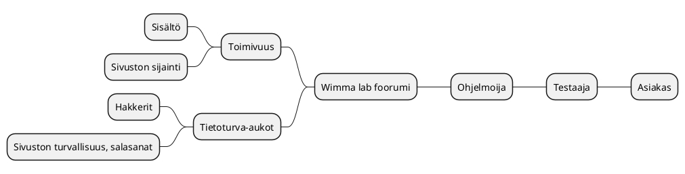
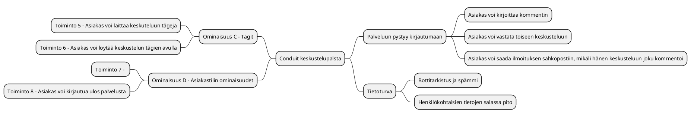
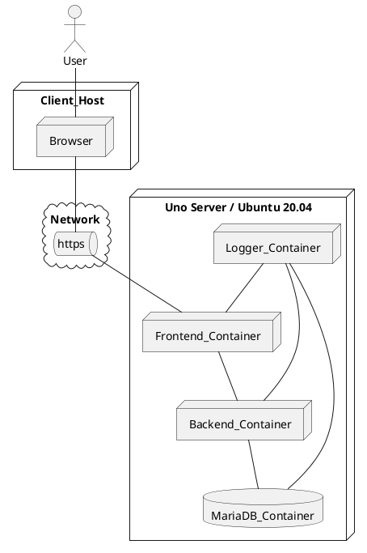

# Tiivistetty vaatimusmäärittely

|  |  |
|:-:|:-:|
| Dokumentti | Tiivistetty vaatimusmääritelmä |
| Laatija: | Pirjo M |
| Versio: |2.3 |
| Päivämäärä: | 3.11.2022 |

## Johdanto

Asiakkaana on WIMMA Lab-koulutusympäristö, joka on kehittämässä toimintaansa laajemmaksi. Asiakkaan toimeksiantona on tuottaa palveluna Foorumi-ratkaisu, WIMMA Lab-kotisivujen osaksi. Foorumin pohjana käytetään ns. Conduit-ohjelmistoa, joka on ennalta valittu asiakkaan puolesta.
Code Cerub vastaa tämän jälkeen palvelun tukemisesta ja siihen liittyvästä ylläpidosta. Projektin tavoitteena on muokata ja tuottaa Conduit-ohjelmistosta sopiva versio asiakkaan tarpeeseen. Ylläpito jatkuu erillisen sopimuksen pohjalta.
Asiakkaan edustajana toimii  WIMMA Labilla työskentelevä Kari Pitkäniemi, joka toivoo Forum-keskustelupalstan käyttöön saamista ~4 kk jälkeen projektin alkamisesta.

## Kohderyhmä 

Foorumilla voi keskustella ja kommentoida toisten aloittamia keskusteluja. Foorumille voi kirjautua ja esim. seurata muita käyttäjiä sekä tykätä toisten keskusteluista. Käyttäjäryhmänä nuoret, aikuiset ja kohderyhmään kuuluvat henkilöt, opiskelijat.


## Sidosryhmäkartta



**Tarkennettut sidosryhmätprofiilit** 

| ID |  Nimi | Kuvaus | Motivaatio |
|:-:|:-:|:-:|:-:|
| SR-001 | [Asiakas profiili Jonne](pohjat/pohja-profiilikuvaus.md) | Nuori 16-22V | Selkeä tarve palvelulle ja tarvitsee palvelua usein |
| SR-002 | [Asiakas profiili Anne](pohjat/pohja-profiilikuvaus4.md) | Aikuinen 22-45V | Tarve satunnainen, mutta yleisin asiakas  |
| SR-003 | [Sidosryhmä - Rahoittaja Roope](pohjat/pohja-profiilikuvaus3.md) | Pääomasijoittaja | Palvelun tuottamat tuotot |
| SR-004 | [Sidosryhmä - Hakkeri Harri](pohjat/pohja-profiilikuvaus2.md) | Nuori hakkeri | Kerätä tietoa ja haavoittuvuuksia  |
| SR-005 | [Sidosryhmä - Palveluntuottaja N5589](pohjat/pohja-profiilikuvaus5.md) | Keski-ikäinen täti-ihminen | Palvelun ylläpitäjä  |

## Palveluun liittyviä asiakaspolkuja

Kuinka saada asiakkaat sivustolle? Mainonta, sosiaalinen media, verkostot, esim. ystäväpiirit.
Kuinka saada sivustosta turvallinen? Kirjautuminen, vahva salasana, testaus.
Palvelun helppokäyttöissys

Houkutteleva visuaalinen sivuston ulkoasu. 
Helppokäyttöisyys, esim. yksinkertaiset napit, selkeät ohjetekstit, värimaailma.
Turvallisuus - palvelun käyttö on turvallista ja asiakas on tyytyväinen.

```plantuml
Step1: Asiakas löytää sivuille 
Step2: Asiakas tutustuu palveluun
Step3: Asiakas saa palvelusta ensivaikutelman
Step4: Asiakas tekee päätöksen, jääkö sivuille
Step5: Asiakas käyttää palvelua
Step6: Asiakas poistuu palvelusta

[*] --> Step1
Step1 --> Step2
Step2 --> Step3
Step3 --> Step4
Step4 --> Step6
Step4 --> Step5
Step5 --> Step6
```

## Palvelun ominaisuudet (Features)

**Pääominaisuudet ja toiminnot**

Conduit keskustelupalsta, johon pystyy kirjoittamaan kommentin ja kommentoimaan toisten kirjoituksia.


| Ominaisuus (Feature) | Toiminto (Function) |
|:-:|:-:|
| *[Home-nappi](ominaisuus1.md)* | |
|| Home-nappia painaessa siirrytään takaisin etusivulle |
| *[New-post nappi](ominaisuus2.md)* | |
|| New-post nappia painamalla siirrytään uudelle sivulle |
| *[New-post sivuston ominaisuudet](ominaisuus3.md)* | |
|| Asiakas voi kirjoittaa otsikon |
|| Asiakas voi kirjoittaa mistä artikkeli kertoo |
|| Asiakas voi kirjoittaa arttikkelin|
|| Asiakas voi laittaa artikkeliin tunnistetageja |
| *[Publish article-nappi](ominaisuus4.md)* | |
| *[Settings-nappi](ominaisuus5.md)* | |
|| Kuvan asetus-kenttä|
|| Nimen tai nimimerkin asetus-kenttä |
|| Mahdollisuus kirjoittaa pieni esittely itsestä |
|| Sähköpostiosoite-kenttä |
|| Salasanan uusiminen-kenttä |
| *[Update settings-nappi](ominaisuus6.md)* | |
| *[Log out-nappi](ominaisuus7.md)* | |
|| Asiakas pystyy kirjautumaan palvelusta ulos |
| *[My profile-nappi](ominaisuus8.md)* | |
|| Näkee omat tiedot |
|| Näkee itse asettamansa profiilikuvan sekä esittelytekstin|
|| Näkee kirjoitetut artikkelit |
|| Näkee myös muiden kirjoittamat artikkelit |
|| Näkee onko artikkeleilla tykkäyksiä |
| *[Edit profile-nappi](ominaisuus9.md)* | |
| *[Asiakkaan toiminnallisuudet](ominaisuus10.md)* | |
|| Asiakas voi saada sähköpostia, mikäli hänen keskusteluun vastataan |
|| Asiakas voi irtisanoutua palvelusta |
| *[Tagit](ominaisuus11.md)* | |
|| Asiakas voi laittaa keskusteluun avainsanoja eli tageja |
|| Tageilla voi etsiä tiettyjä keskusteluja |


>Jokainen ominaisuus kannattaa kuvata itsenäisenä dokumenttina, koska niihin liittyy paljon tarkentavaa tietoa. Tutustu esimerkkinä [FEAT0001](20-Vaatimustenhallinta/ominaisuus-FEA0001.md). Kuvauksen tekemiseen käytetään tarvittaessa seuraavaa [pohjaa](pohja/../pohjat/pohja-ominaisuus.md). 


**Kirjataan ominaisuudet vielä MindMap-muotoon ja samalla linkitetään niihin liittyvät toiminnot**



# Toiminnalliset vaatimukset (Functional Requirements)

| ID | Toiminnallisen vaatimuksen kuvaus | ominaisuus	|				
|:-:|:-:|:-:|
| [FUNCREQ-C0001]() | Palveluun voi kirjautua | [Kirjautumis-ominaisuus](pohjat/pohja-ominaisuus.md) |
| [FUNCREQ-C0002]() | Kirjautuneena käyttäjänä palveluun voi lisätä profiilikuvan | [Lisää profiilikuva](pohjat(pohjat/pohja-ominaisuus.md)) |
| [FUNCREQ-C0003]() | Kirjautuneena käyttäjänä voi kirjoittaa itsestään esittelytekstin | [Esittelyteksti]() |
| [FUNCREQ-C0004]() | Kirjautuneena käyttäjänä voi päivittää oman salasanan/vaihtaa sen | [Salasanan vaihto]() |
| [FUNCREQ-C0005]() | Kirjautuneena käyttäjänä voi kirjautua palvelusta ulos | [Uloskirjautuminen]() |
| [FUNCREQ-C0006]() | Kirjautuneena käyttäjänä voi poistaa oman kommentin | [Kommentin poistaminen]() |
| [FUNCREQ-C0007]() | Kirjautuneena käyttäjänä voi poistaa oman artikkelin| [Artikkelin poistaminen]() |
| [FUNCREQ-C0008]() | Kirjautuneena käyttäjänä voi muokata omaa artikkelia | [Artikkelin muokkaaminen]() |

## Käyttöliittymänäkymä/mockup 


## Ketterän kehittämisen käyttötarinat - User Story 

- Palvelun tuottajana haluan, että palvelu huomauttaa artikkelin kirjoittajalle (suomeksi) tekstin sisällön asiallisuudesta, jos se sisältää "ala-arvoista" kieltä. 
Issue#37   
User Story

- Palvelun tuottajana haluan käytää konttien jakamisessa labranetin gitlab rekisteriä 
Issue#36
User Story
 
- Järjestelmän ylläpitäjänä haluan että tuotannon tietokannasta voidaan ottaa tarvittaessa backup komentoriviltä
Issue#35 
User Story

- Palvelun kehittäjänä haluan saada loppukäyttäjän palautteen Issue-muodossa eteeni, koska se on selkeämpää jatkokäsitellä
Issue#34
User Story

- Palvelun käyttäjän toivon, että palvelu on luotettava ja se käyttää suojattuja HTTPS-yhteyttä, koska en uskalla käyttää HTTP-palveluja nykyaikana
Issue#33
User Story

- Toimeksiantajana toivon, että sivusto näyttää visuaalisesti yhtenäiseltä, jos käyttäjä menee foorumille
Issue#32
User Story

- Kehittäjänä haluan käynnistää kehitysympäristön nopeasti käyttäen kontteja
Issue#31  
User Story

- Testaajana haluan käyttää Docker-kontteja, koska se helpottaa testi ympäristön pystyttämistä
Issue#30
User Story

- Palvelutuottajan haluan vaihtaa palvelun värit WIMMA Lab-sivuston mukaisiksi
Issue#29
User Story

- Palvelutuottajan on palvelustamme löydyttävä tietosuojakuvaus infosivu, koska GDPR sitä edellyttää
Issue#28
User Story

- Palvelutuottajana haluan auttaa loppukäyttäjää erillisen tukiportaalin kautta kuormittamatta kehitystiimiä ylimääräisillä kysmyksillä
Issue#27
User Story

- Palvelutuottajana haluan saada palautetta loppukäyttäjilä, jonka perusteella tuotetta voidaan kehitää paremmaksi
Issue#26 
User Story

- Forumin käyttäjänä toivon voivani palata helposti WIMMA Lab-sivustolle, koska haluan vielä tarkastella sitä uudelleen
Issue#25
User Story

- Kehittäjänä haluan, että voin käynnistää kehitysympäristön docker-compose up komennolla
Issue#24
User Story

- Palvelutuottajana haluan ajaa palvelua Docker-tekniikan varassa, koska se selkeyttää tuotantoa
Issue#23  
User Story

- Keskustelupalstalla vastaus ominaisuus
Issue#22
User Story

- Asiakas haluaa keskustelupalstan
Issue#21
User Story

- Käyttäjänä haluan, että voin luoda raportin tekemistäni ostoista viimeisen kuukauden ajalta, koska se helpottaa oman talouteni hallintaa
Issue#14
User Story

## Tietojärjestelmiä yleisesti koskevista vaatimuksista


## Palveluun liittyvät tekniset vaatimukset

Tarvittava palvelinympäristö, tietokanta, varmistusjärjestelmät ja muut palvelun toiminnan kannalta oleelliset tarpeet.

| ID | Kuvaus | 
|:-:|:-:|
| HWREQ-0001 | Palvelun on oltava skaalattavissa HA-proxy ratkaisun varassa | |
| HWREQ-0002 | Palvelimen muistikapasiteeti >32GB  ||
| HWREQ-0003 | Palvelimen fyysinen sijainti on oltava EU-aluella| |

## Laadulliset vaatimukset (Non-functional Requirements)


### Suorituskykyvaatimukset (Performance Requirements)

### Tietoturvavaatimukset (Security Requirements)

| ID |  Kuvaus |
|:-:|:-:|
| SECURITY-REQ-0001 | Salasanassa on käytettävä vähintään MD5-tason salausta, koska vaatimus [CONSTRAIN-000]() sitä edellyttää |
| SECURITY-REQ-0002 | Jokainen tapahtuma palvelussa on kirjattava käyttölogiin, että niitä voidaan tarkastella myöhemmin | 
| SECURITY-REQ-0003 | Salasanojen tallennus ja säilyttäminen turvallisessa paikassa, etteivät hakkerit pääse niihin käsiksi|
| SECURITY-REQ-0004 | Bottien estäminen sivustolla turvallisuustarkastuksilla |
| SECURITY-REQ-0005 | Tietoturva-aukkojen selvittäminen |
| SECURITY-REQ-0006 | Henkilökohtaisien tietojen kerääminen |
| SECURITY-REQ-0007 | Turvalliset oletusasetukset |
| SECURITY-REQ-0008 | Ohjelmistopäivitykset ja niiden vaikutukset sivustoon|
| SECURITY-REQ-0009 | Tietosuoja-asetukset kunnossa |

### Saavutettavuusvaatimukset (Accessablity Requirements)

Digitaaliset palvelut pitäisi olla kaikkien saataville. Palveluiden pitäisi toimia kännykällä, tietokoneella ja tabletilla.
Palveluja voi käyttää, vaikka käyttäjällä olisi kuulo- tai näkövamma, luki- ja oppimisvaikeus, muistihäiriö tai vaikkapa heikko suomen kielen taito. Saavutettava verkkopalvelu on lähdekoodiltaan virheetöntä ja loogista, standardien ja ohjeistusten mukainen. Verkkosivusto toimii erilaisilla päätelaitteilla ja avustavilla teknologioilla, kuten puheohjauksella ja ruudunlukuohjelmalla.
Saavutettavuusvaatimuksilla yritetään toteuttaa yhdenvertaista suomea, jolloin kaikki olisivat samanarvoisia ja kaikki palvelut olisi saataville myös heille, joilla on joku vamma tai vaikka värisokeus.

| ID  |  Kuvaus |
|:-:|:-:|
| ACCESSREQ-0000 | Palvelun käyttöliittymässä on mahdollista valita selkeä kontrastinen teema |	
| ACCESSREQ-0001 | Käyttöliittymän Fonttikokoa on voitava muuttaa päävalikon kautta |
| ACCESSREQ-0002 | Palvelu on valittavissa suomen ja englannin kielellä |
| ACCESSREQ-0003 | Palvelu on saatavilla puheohjauksella |
| ACCESSREQ-0004 | Käyttöliittymä on selkeä ja helppo käyttää |
| ACCESSREQ-0005 | Mahdollisissa videoissa/kuvissa on kuva/videoteksti|
| ACCESSREQ-0006 | Palvelussa on yhteystiedot, jonne voi ilmoittaa esim. häiriöistä |
| ACCESSREQ-0007 | Käytettävyys pelkällä näppäimistöllä |
| ACCESSREQ-0008 | Palvelun on toimittava eri laitteilla |

## Rajaukset ja reunaehdot (Constraints and limitations)

>Eri ohjelmistojena/palvelujen toteutusta ja käyttöä ohjaavat usein lait ja säädökset. Näiden edellyttämät vaatimukset kirjataan vaatimusmäärittelyyn rajauksina. Rajausten (Constraints) vaikutus voi koskea koko palvelua palvelun jonkin osa-kokonaisuuden toteuttamista. Tästä syystä eri rajoitteet on tunnistettava ajoissa, koska vaikutus saataa olla varsin ratkaiseva pitemmällä tähtäimella. Esimerkkinä tästä on viime vuonna voimaan tullut [EU GDPR-säädös](https://en.wikipedia.org/wiki/General_Data_Protection_Regulation).
Kannattaa tutkia esimerkiksi https://www.sfs.fi/aihealueet/terveydenhuolto/laakinnalliset_laitteet tai http://docs.jhs-suositukset.fi/jhs-suositukset/JHS190/JHS190.html

| ID |  Rajaus/reunaehto | Mihin vaikuttaa |
|:-:|:-:|:-:|
| CONSTRAIN-000  |  Palvelun kirjautumisprosessin on noudatettava JUHTA-hyväksyttyjä käytänteitä  | [Feature Kirjautuminen](pohjat/pohja-ominaisuus.md) |
| CONSTRAIN-001 |  Palvelussa on huomioitava JHS:n suosituksest lokihallinasta | [Feature - Lokihallinta](pohjat/pohja-ominaisuus.md)|
| CONSTRAIN-002 |  ... | ... |

## Ohjelmistoarkkitehtuuri

>Vaatimusmäärittelyn osaksi voidaan tarvittaessa liittää teknillisiä kuvauksia, joiden avulla voidaan tarkentaa eri vaatimuksia. Yksi tärkeä dokumentti voi olla esimerkiksi tekninen arkkitehtuuri. Tämä kuvaus voidaan lyhyessä muodossaan liittää osaksi vaatimusmäärittelyä, mutta yleensä se on varsin laaja itsenäinen dokumentaation osa. Arkkitehtuuri ratkaisujen kuvaamiseksi voidaan laatia yödyntäen apuna UML-kuvauskielen eri diagrammeja. Esimerkkinä alla on  sijoittelunäkymä ([Deployment Diagram](https://plantuml.com/deployment-diagram)). Sijoittelunäkymän avulla voidaan kuvata miten palvelun eri palvelut sijaitsevat ja miten ne kytkeytyvät toisiinsa.

Ohjelmistoarkkitehtuurin kuvaus on itsessään laaja osa-alue ja käytännössä se edellyttää laajempaa dokumentaatiota.



## Standardit ja lähteet

>Kirjataan käytetyt lähteet alla olevaan taulukkoon.

| ID | Nimi | Linkki | Kuvaus |  
|:-:|:-:|:-:|:-:|
| REF1 | JHS 165 ICT | [JHS Suositukset - vaatimusmäärittelylle](http://www.jhs-suositukset.fi/c/document_library/get_file?uuid=b8118ad7-8ee4-459a-a12b-f56655e4ab9d&groupId=14) | Vaatimusmäärittelyn suositus |
| REF2 | ISO 9241-11  | [Käytettävyys](https://fi.wikipedia.org/wiki/K%C3%A4ytett%C3%A4vyys)  | Usability | 
| REF3 |  EN 301 549 | [Saavutettavuus](https://fi.wikipedia.org/wiki/Saavutettavuus) | Availability |
| REF4 |  GDPR | [GDPR Asetus](https://europa.eu/youreurope/business/dealing-with-customers/data-protection/data-protection-gdpr/index_fi.htm) | General_Data_Protection_Regulation |
| REF5 | KATAKRI V11 | [Katakri](https://www.defmin.fi/files/1870/KATAKRI_versio_II.pdf) | Kansallinen turvallisuusauditointikriteeristö |


